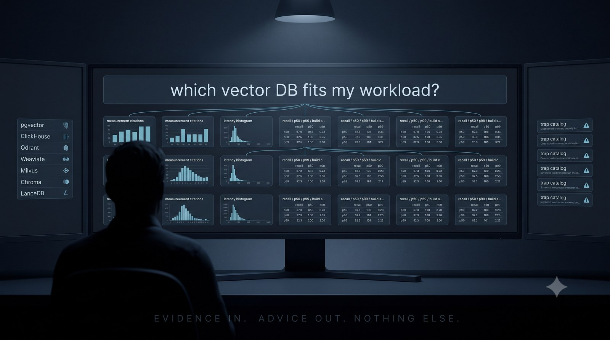

# rag-db-advisor

[](https://github.com/kenimo49/rag-db-advisor/actions/workflows/ci.yml)
[](https://www.python.org/downloads/)
[](LICENSE)



A RAG that answers RAG-stack questions — every claim backed by
[rag-retriever-bench](https://github.com/kenimo49/rag-retriever-bench)
measurements. Ask it which vector backend fits your workload, what a
latency number actually means, or which operational trap you are about
to step on. It only answers from measured evidence.

```
$ rag-db-advisor ask "10万件・日本語・更新頻度高めならどのDB？"
```

## Why this exists

Vector-DB comparisons are usually opinions. This one is a closed loop:

1. **Measure** — rag-retriever-bench runs 9 backend configurations over the
   same corpus (MIRACL-ja), same embeddings, same queries, same metrics
2. **Distill** — results + the operational traps hit during measurement
   become the knowledge base (`knowledge/`)
3. **Serve** — this package retrieves that evidence for your question,
   over MCP or CLI
4. **Dogfood** — the retrieval layer imports rag-retriever-bench's own
   `BaseRetriever` abstraction. The bench data shows every HNSW backend is
   quality-tied at this corpus size (recall@10 0.979–0.983 @10k), so the
   store picks the operationally lightest option: Chroma embedded.
   The advisor follows its own advice.

## Install

```bash
pip install git+https://github.com/kenimo49/rag-db-advisor
export OPENAI_API_KEY=sk-...   # embeddings only (text-embedding-3-small)
rag-db-advisor ingest           # build the local store (54 chunks in v0.1, well under a minute)
```

## Use from Claude Code / Claude Desktop (MCP)

```bash
claude mcp add rag-db-advisor -- rag-db-advisor mcp
```

Tools:

| tool | what it does |
|---|---|
| `advise(question, top_k)` | retrieve measured evidence for a free-form question; the calling LLM synthesizes the answer |
| `compare_backends(corpus_size)` | full comparison table at 10k / 100k docs (quality, latency, build time, index verification) |
| `list_traps(backend)` | operational traps actually hit during measurement |

No generation key needed server-side — MCP returns evidence, your LLM writes
the answer.

## Use from the CLI

```bash
rag-db-advisor ask "ClickHouseのベクトル検索が遅い。何を疑う？"          # evidence only
rag-db-advisor ask "pgvectorとQdrantどっち？" --llm                      # + OpenAI synthesis
```

## What it knows (v0.1)

- 9 backend configurations: pgvector, ClickHouse (HNSW ×2 granularities +
  brute force), Qdrant, Weaviate, Milvus, Chroma, LanceDB
- 2 corpus scales: 10k / 100k MIRACL-ja passages, 860 human-annotated queries
- Operational trap catalog: silent index degradation (3 distinct backends),
  shared-memory limits, load-visibility issues — each one reproduced, fixed,
  and written down
- Methodology caveats baked into answers: embedded vs server latency is not
  directly comparable; numbers are MIRACL-ja + text-embedding-3-small on a
  single node — measure your own data before deciding

## Design notes

- The advisor never generates verdicts. It returns measured evidence and lets
  the calling LLM (or human) synthesize the answer — retrieval failures
  surface as explicit errors so nobody silently falls back to prior knowledge.
- Every chunk in the knowledge base traces back to either a bundled bench
  record (`knowledge/results/*.jsonl`) or a hand-written operational note
  (`knowledge/ja/*.md`). Notes only cover behavior that was reproduced during
  the underlying bench work — speculative advice is out of scope by policy.
- The retriever imports rag-retriever-bench's own `BaseRetriever` and picks
  Chroma because the bench data says every HNSW backend is quality-tied at
  this corpus size. The advisor follows its own advice.

Full write-up: [docs/methodology.md](docs/methodology.md). Extending the
knowledge base: [docs/adding-knowledge.md](docs/adding-knowledge.md).

## License

MIT
